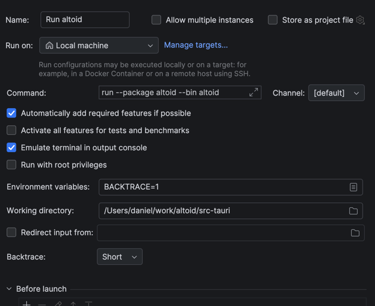

# Tauri + React + Typescript

This template should help get you started developing with Tauri, React and Typescript in Vite.

## Recommended IDE Setup

- [VS Code](https://code.visualstudio.com/) + [Tauri](https://marketplace.visualstudio.com/items?itemName=tauri-apps.tauri-vscode) + [rust-analyzer](https://marketplace.visualstudio.com/items?itemName=rust-lang.rust-analyzer)


# Running the app on Dev

## From the terminal
```agsl
yarn run tauri dev  
```

## From your IDE
### 1. Run the Frontent via the terminal
```agsl
yarn dev
```

### 2. Run Rust
